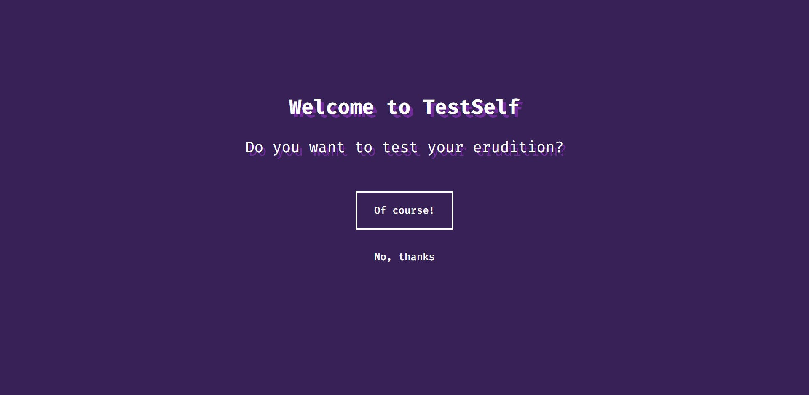
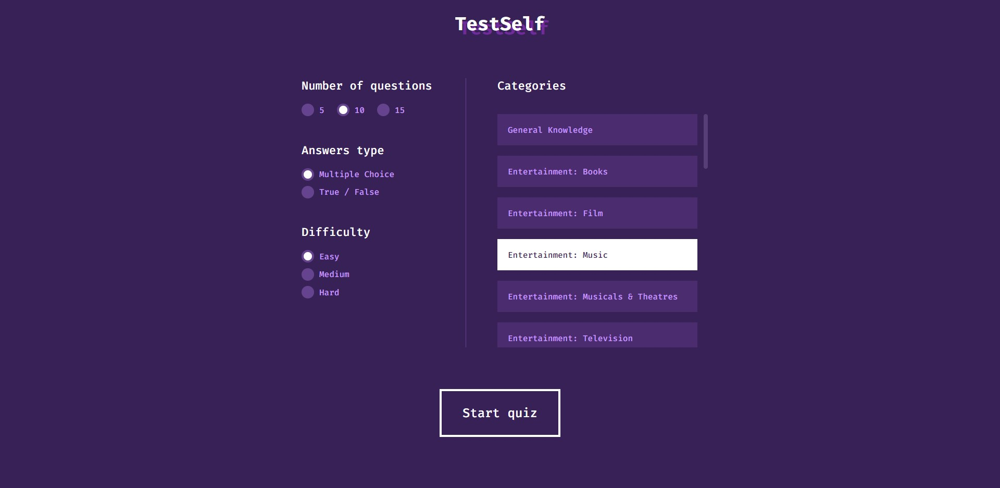
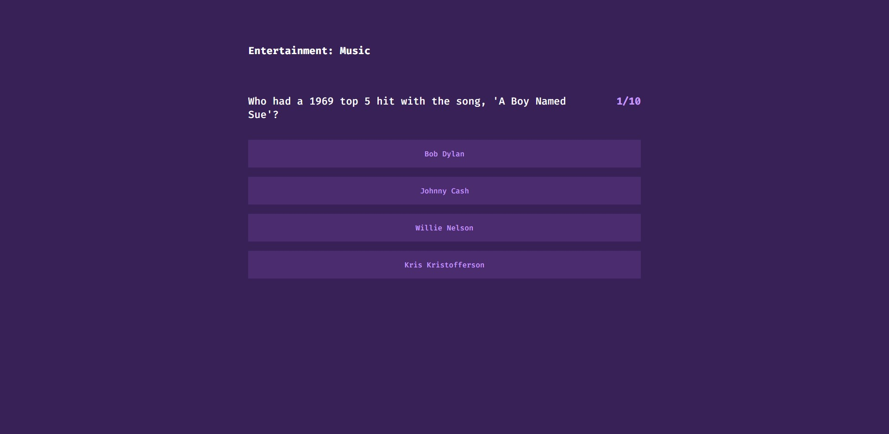
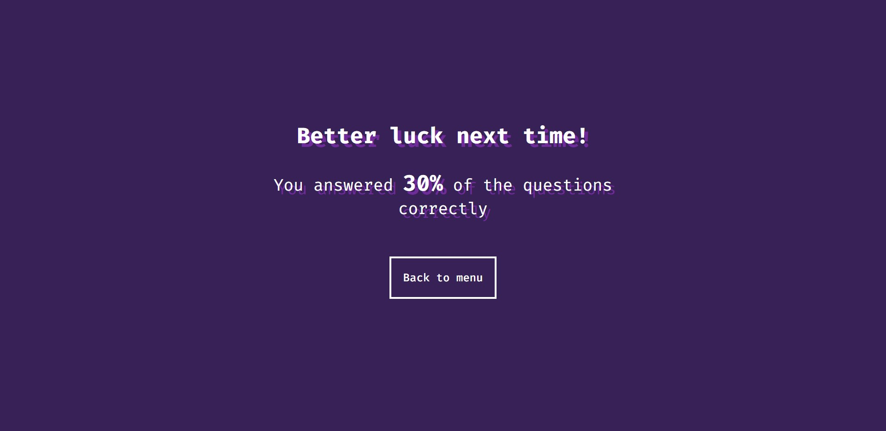

# TestSelf

> TestSelf is a quiz app built with React + Redux. You can check it here: https://testself.netlify.app

## Table of contents

* [About TestSelf](#about-testself)
* [Some screenshots](#some-screenshots)
* [Technologies](#technologies)
* [Setup](#setup)
* [Features](#features)
* [Status](#status)
* [Contact](#contact)

## About TestSelf

This project started out as a way to learn more about React.js framework in conjunction with Redux. A quiz app is a great way to understand how a web app works when built in React. The number of correct answers, the parameters of the quiz - all this allows you to play around with state management (Redux).

## Some screenshots

## Technologies

* HTML, CSS, JavaScript
* React.js
* Redux
* API: Open Trivia Database

## Setup

Clone this repo and run "npm install" in your terminal to install all the dependencies

## Features

* Intuitive interface
* Setting up a quiz by difficulty, type and number of questions
* App uses completely free JSON API

## Status

Project is: _finished_

## Contact

If you interested in working with me, feel free to contact me at: <r0llit@protonmail.com> !
